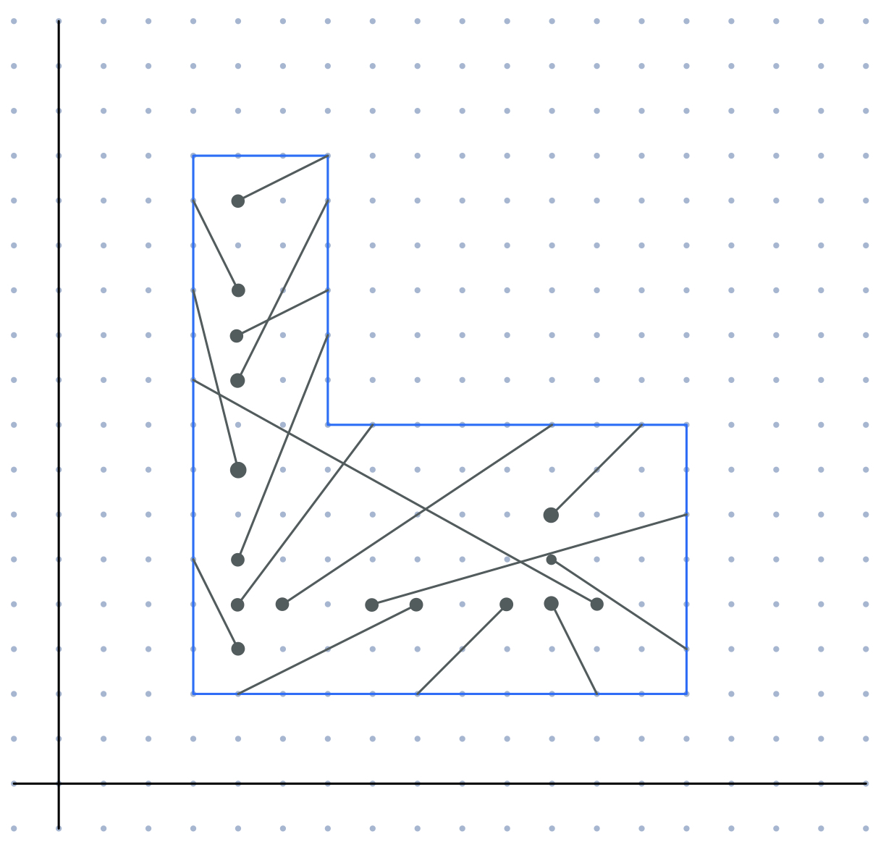
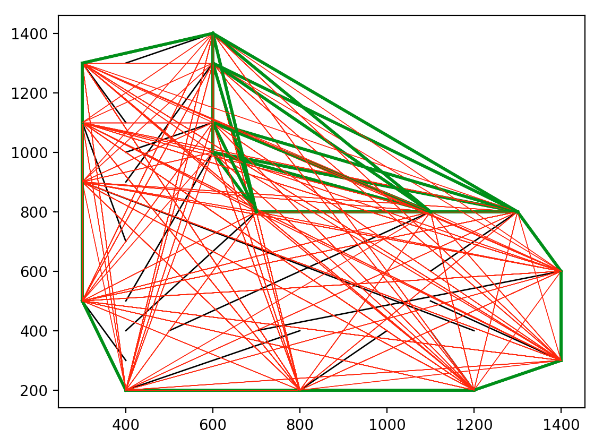
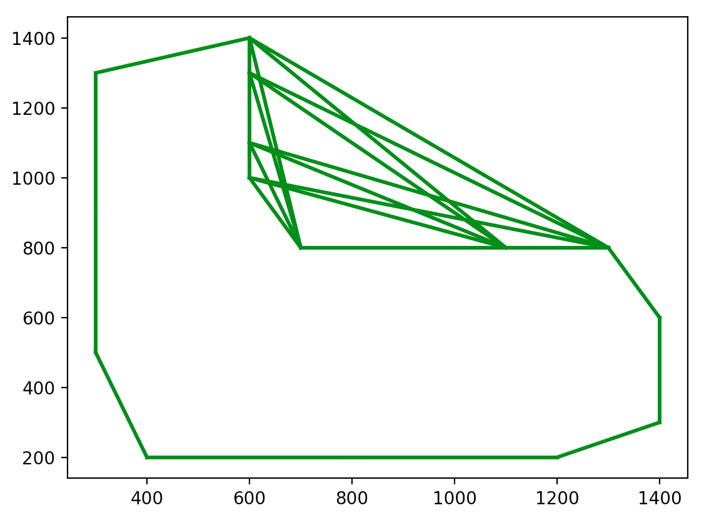
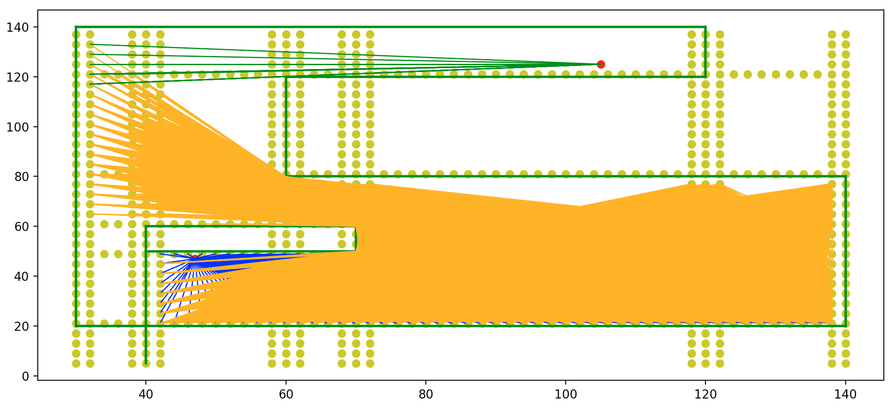
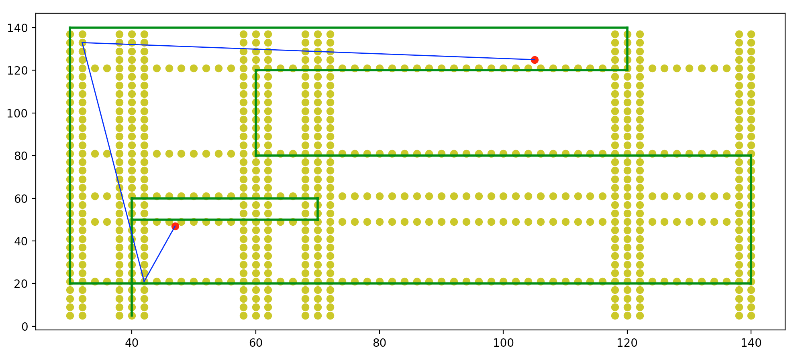

# AVBbot
## Setup
Running `install.sh` will install Python 3.9 and create a venv with the necessary python requirements.

Robot parameters must be set in `config.json`, and the correct environment must be selected ("development" or "production").

Note: Some of the archived code involves Arduino code with dependency on the AFMotor.h library, available from Adafruit.

## Hardware (v2)
-

## Control Systems
-

## Localization (MPS)

AVBbot uses a manual positioning system to localize the robot in its environment at any given time. After each successful motion recorded by the microcontroller (Raspberry Pi Pico or Arduino), movement data is passed into `scripts/localization.py` describing how many steps each stepper motor completed. Using the hardware parameters outlined in `config.json`, the MPS (Manual Positioning System) is able to use basic trigonometry and kinematics to determine a relative position. This position is then added to the current position stored in `data/current_position.json` to determine an object position.

Note that there are no PID correction loops implemented as of yet, nor are there any safeguards preventing manual errors to corrupt the localization efforts; hence, the robot is required to 'home' itself every few minutes where it can reset its position to x=0, y=0, direction=90°. AVBbot is able to home itself despite potential inaccuracies in `data/current_position.json` through the use of CV and landmarks setup during the learning phase.

## Cartography (Learning)

Before being fully functional, AVBbot must undergo a learning phase to fully understand its surroundings and create a map of where it is able to travel. This is accomplished by having the robot travel in a randomized pattern for some time and using the ultrasonic sensor to detect and avoid collisions. During this travel, AVBbot collects positional and wall data every few seconds, which is later used to create a map. An example is provided below to further explain the mechanics of this process.

In the following example, a simple L-shaped room is theorized wherein AVBbot is able to travel. The **blue lines** indicate the walls of the room, which are unknown to AVBbot. As it travels, it is able to use the MPS to track its current position, and further use the ultrasonic sensor to track the distance to the closest wall or obstacle. Using the current position and orientation, the position of a _wall-point_ can be established. the **gray lines** indicate data points collected by AVBbot, where the circle-end of the line is its current position and the other end is the _wall-point_.
 

The data points presented in the image above are collected and stored in `data/spatial_data__*.csv` in the following manner:
|Spatial Point X|Spatial Point Y|Wall Point X|Wall Point Y|
| --- | --- | --- | --- |
|800|400|400|200|
|1000|400|800|200|
|1100|400|1200|200|
|1200|400|300|900|
|700|400|1400|600|
|500|400|1100|800|
|400|400|700|800|
|400|500|600|1000|
|400|300|300|500|
|1100|500|1400|300|
|1100|600|1300|800|
|400|700|300|1100|
|400|900|600|1300|
|400|1000|600|1100|
|400|1100|300|1300|
|400|1300|600|1400|

Once the data collection process is complete, the main cartography algorithm kicks in to connect all the dots and create the map. `scripts/cartography.py` first starts by connecting every _wall-point_ together creating a web of possible _wall-lines_. Then the code proceeds to use the `data/spatial_data__*.csv` from above to create all the lines that are supposed to signify empty space, as the ultrasonic sensor would not have been able to capture that line if it were obstructed. Then by comparing these _spatial-lines_ with all the possible _wall-lines_, many of the _wall-lines_ can be rejected on the basis of them intersecting with a spatial line, which is known to be empty space. The illustration below shows this process in action, where the **black lines** represent the previously collected data, and the other lines are all potential _wall-lines_. The lines that are **red** have been rejected due to an intersection with a _spatial-line_, while the **green lines** indicate a successful wall.
 

Clearing up this figure of all unnecessary lines, the final map can be seen below; coordinates of which are then stored into `data/map_walls__*.csv`.
 

It should be noted that a longer learning phase would result in more data, increasing the accuracy of the final map.

Finally, a series of equidistant gridpoints are created inside of the defined space to allow for easier navigation later on. These gridpoints represent every undefined position AVBbot is able to navigate to and are stored in `data/map_gridpoints__*.csv`.

## Navigation

`scripts/navigation.py` is able to create an efficient path for AVBbot to travel from point A to point B using only linear paths.

The first stage in this process involves trying to connect point A to point B directly, and checking if the line created intersects with any _wall-lines_ in `data/map_walls__*.csv`. If a direct connection is not possible, then point A will attempt to connect to every gridpoint it can without causing an intersection. Then for each gridpoint that it is connected to, this exact process repeats where a connection is attempted to point B, otherwise, connections are created to all available gridpoints. This is illustrated below, where point A is the red dot at the bottom left (47.0, 47.0) and point B is the red dot at the top right (105.0, 125.0). Orange dots represent gridpoints and the green lines are indicative of _wall-lines_. The first set of lines created are the blue ones, after which the blue lines connect to a vast network of orange lines, few of which are able to connect to point B using the green lines; thus concluding that a 3-segment path is possible between point A and point B.
 

Using this data, a variation on the popular graph algorithm is employed to generate a single 3-segment path that AVBbot may follow, as is seen below.

The to be followed is below; instructions for which are fed to the microcontoller to execute.
 (47.0, 47.0) -> (42.0, 21.0)
 (42.0, 21.0) -> (32.0, 133.0)
 (32.0, 133.0) -> (105.0, 125.0)

Note: The navigation algorithm is still undergoing many changes to enhance efficiency and usability. Processing times for the above algorithm can often take up to 3 minutes when deployed on the Raspberry Pi 4.
